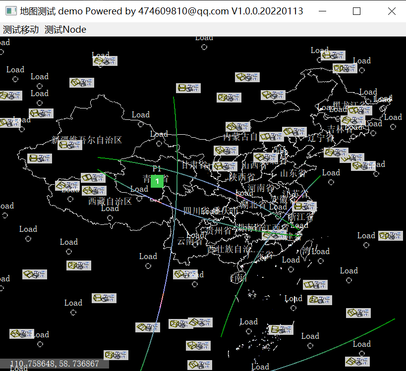

# QtMapView
是一个基于Qt5.14.2开发的地图展示Widget.轻量级，只额外依赖QtLocation模块：```location``` ```location-private```。适用于简单地图展示与少量动画效果显示。
内部纯手绘完成地图渲染与图标显示，不依赖任何GIS框架与库。

## 功能说明
* geoJson地图加载与显示
* 地图缩放、拖动操作
* 地图坐标与视图坐标转换
* 地图结点显示：支持QWidget及其子类的直接绘制
* 内置静态图片结点显示:```QtMapImageItem```
* 内置动态图片结点显示:```QtMapGifItem```
* 内置动态传输线结点显示:```QtMapLineItem```
* 支持其他结点显示扩展:继承```QtMapItem```即可


## 目录说明

- **3rd** 可以直接使用的第三方库
- **bin** 生成的可执行文件
- **build** 编译生成的目录
- **doc** 项目的一些文档
- **include** 项目公开的头文件
- **project** 项目的工程文件
- **refer** 参考资料
- **src** 项目的源代码
- **test** 项目的测试代码
- **tool** 项目开发或者生命周期中会用到的工具

## 使用手册

 

### 编译
使用QtCreator编译```project/qtcreator/main.pro```

### 运行
双击启动```bin/Windows_x86/main_vc140_x86.exe```
程序内容如下：
1. 示例绘制了100个gif结点

    旋转动画：   
    加载动画：
    
2. 2个Image结点、5个动态传输线结点。

    P1：   
    P2：
    
3. 多条传输线。

    最终示例：     
    

## TODO
* 优化渲染方式，避免频繁计算绘制
* 新增结点图层Z坐标设置，方便前后排布
